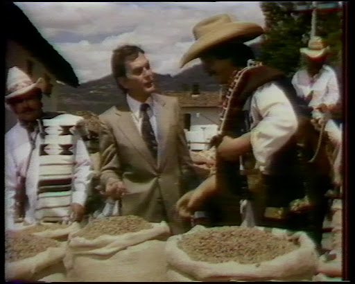
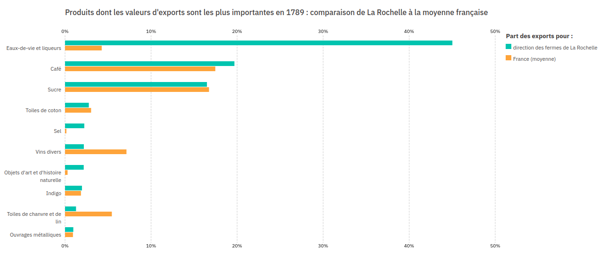
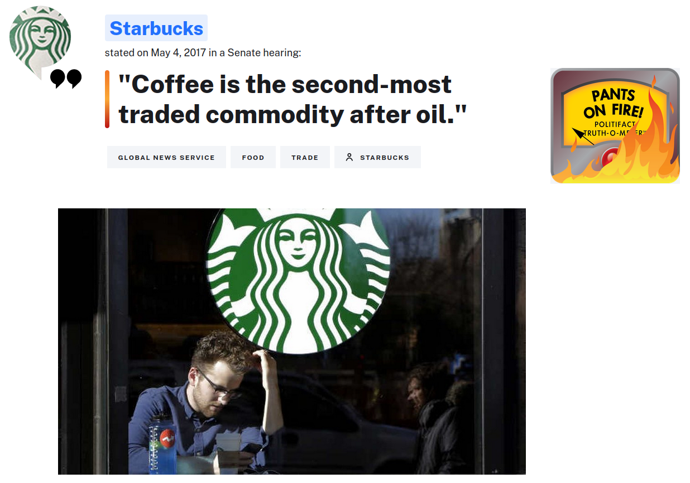
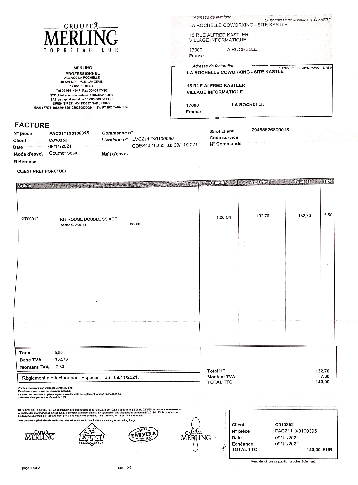
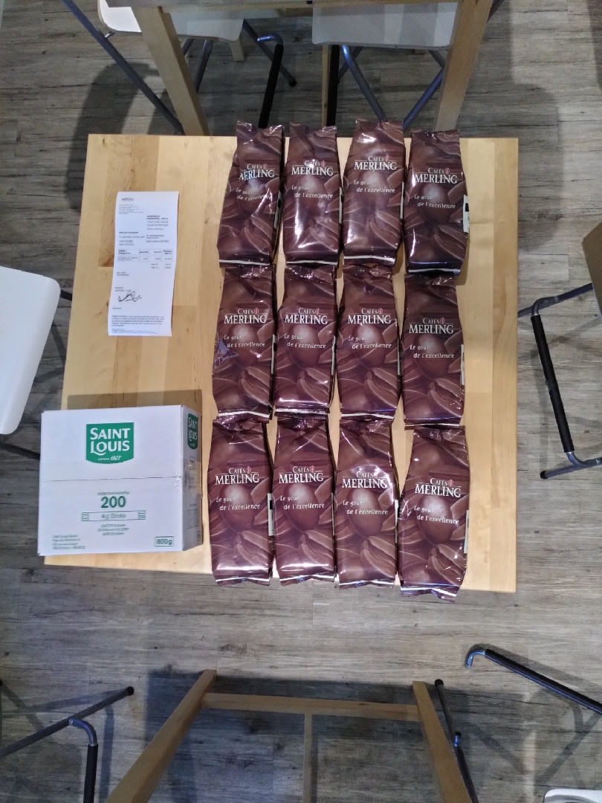

layout: true
  

`r paste0("
", params$event, " 

")` 

---

background-image: url("./img/premier_confinement.png")
background-size: cover
class: inverse

# Comment je suis devenu caféinomane

---

background-image: url("https://media.giphy.com/media/NHUONhmbo448/giphy.gif")
background-size: cover
class: inverse

# Première nécessité !

---

background-image: url(./img/etiquette_windara.jpg)
background-size: cover
class: inverse

# Le café : commodité ou spécialité ?

.right[
.footnote[
Pure origine, Ethiopie Yrgachefe Chelchele Bio
Source : [Windara](https://www.cafeswindara.com/cafes-boutique/p/le-meilleur-cafe-en-grains-yrgachefe-chelchele)
]
]

---

background-image: url("./img/cafe_methode_naturelle.png")
background-size: cover
class: inverse

## Du café rouge au café vert

.footnote[Coopérative SOPACDI, République démocratique du Congo Source : [Esperanza café](https://www.instagram.com/p/CLJ5nFAB6hd/?epik=dj0yJnU9TlgwMXdOaWk2eHJLUnhIRHNaMzhrQTFBNDZoLXZBTTQmcD0wJm49eWFBSHZseTdnZV9yVUphT3pEYWlHZyZ0PUFBQUFBR0dmUjFj)]

---

background-image: url(./img/cafe_torrefaction.jpg)
background-size: cover
class: inverse

## La "torréf"

.footnote[**Source : [Beans on fire](https://www.instagram.com/p/CUXw0m7rzZr/?utm_medium=copy_link&epik=dj0yJnU9UHgtUmFXWlpzQVFtNFJPakU4T20xTlpsLVJQTmpRVWsmcD0wJm49N2ZLTXhUT196OHJRLXBhUVdJcjI2USZ0PUFBQUFBR0dmU0Qw)**.]

---

class: inverse

## Le "dark roast" : *"hé Gringo, il est crâmé ton café !"*

.center[

]

---

## Une marchandise "mondialisante"

.center[

]

Medialab Sciences Po / Nantes Dataviz, Portic Storymap 
[Produits dont les valeurs d'exports sont les plus importantes en 1789 : comparaison de direction des fermes de La Rochelle à la moyenne française](https://medialab.github.io/portic-storymaps-2021/fr/atlas/partie-1-produits-importants-pour-la-rochelle).

---

## Attention aux vieilles idées

.center[

]

.right[
.footnote[Source : [Politifact](https://www.politifact.com/factchecks/2017/may/08/starbucks/no-coffee-not-second-most-traded-commodity-after-o/)]
]

---

## Les composantes de l'offre

.pull-left[
### éléments techniques

* fourniture machine (leasing, location, achat) ;
* fourniture café ;
* fourniture consommable (filtres) ;
* réglage machine ;
* entretien machine ;
* (récupération du marc).
]

.pull-right[
### éléments pratiques

* fonctionnement ;
* approvisionnement ;
* facturation ;
* paiement ;
* renouvellement ;
* convivialité.
]

---

## La café au WorkingShare (à Kastler en tout cas)

.pull-left[

]

.pull-right[

]

---

## Avantages / Inconvénients

.pull-left[
### côté plus

* stabilité ;
* facilité d'approvisionnement ;
* régularité du produit ;
]

.pull-right[
### côté moins

* qualité du produit ;
* traçabilité du produit ;
* critères éthiques ;
* offre fermée.
]

---

# Proposition 1

.quote[
tester l'offre Windara : une machine, un blend de saison et le réglage.
]

Nous pouvons évoquer les options avec Victor, qui est venu spécialement pour ça !

---

# Proposition 2

.quote[
instaurer un "forfait café" indexé sur le nombre de jours de présence par mois
]

Sur la base de 3 cafés par jour par personne en moyenne, il pourrait être de 1€ par jour (soit 22€ pour un temps plein, 10 pour un flex, etc.).

Cela présenterait l'avantage de :
* se débarasser de la facturation actuelle tout en ajoutant de la lisibilité ;
* sécuriser la trésorerie et éviter les retards de paiement du fournisseur.

---

# Proposition 3

.quote[
proposer ma candidature à la cogérance pour accompagner cette transition et prêter main forte sur les autres sujets
]

---
class: inverse, center, middle

# Merci !

Contact : [sylvain@datactivist.coop](mailto:sylvain@datactivist.coop)

